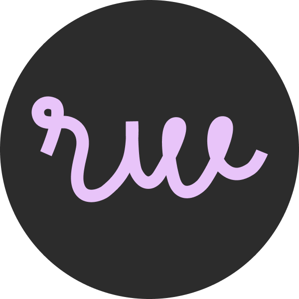

   <h1 align="center">Hola, soy Rafael Barrientos 👋</h1>

<strong>Desarrollador Full Stack</strong>

   
  

## Mi Filosofía

Creo firmemente en la creación de soluciones que sean:

- **Simples**: La elegancia en la programación reside en la simplicidad. Busco soluciones claras y concisas que sean fáciles de mantener y escalar.
- **Rápidas**: Entiendo la importancia de la velocidad en el mundo digital actual. Me esfuerzo por desarrollar aplicaciones de alto rendimiento que ofrezcan una experiencia de usuario fluida.
- **Efectivas**: Mi objetivo principal es entregar resultados que superen las expectativas. Me enfoco en comprender las necesidades del cliente y traducir esas necesidades en soluciones funcionales y de alto valor.
- **Desarrollo Continuo**: Fomento la cultura de la mejora continua en cada proyecto, implementando prácticas de integración y entrega continua para optimizar el ciclo de vida del software.

## Habilidades Técnicas

Mi experiencia abarca un amplio espectro de tecnologías, incluyendo:

- **Lenguajes de Programación**:
  - Go
  - Java
  - Shell
  - JavaScript
- **Tecnologías de Google**:
  - Apigee
  - Firebase
- **Frameworks Web**:
  - Astro
- **Desarrollo Continuo**:
  - Jenkins

## Lo que me motiva

Me impulsa la curiosidad y el deseo de aprender constantemente. Disfruto explorando nuevas tecnologías y metodologías para mejorar mis habilidades y ofrecer soluciones aún más innovadoras. Estoy comprometido con la excelencia y siempre busco formas de superar los límites de lo posible.

## Conectemos

Si estás buscando un desarrollador Full Stack apasionado y orientado a resultados, ¡no dudes en contactarme! Estoy siempre abierto a nuevas oportunidades y colaboraciones.
